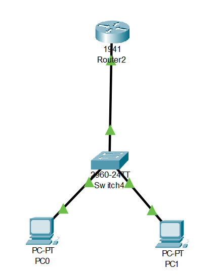

# Lab 1 – Réseau Local Basique

## 🎯 Objectif
Configurer un **réseau local simple (LAN)** avec :
- 2 PC
- 1 Switch
- 1 Routeur  

Vérifier la communication entre tous les appareils et tester la connectivité.

---

## 🖼 Topologie du réseau

*Représentation simplifiée :*

  PC1
   |
   |
  Switch ---- Routeur
   |
   |
  PC2

---

## 🌐 Plan d’adressage IP

| Appareil | IP           | Masque         | Gateway         |
|----------|-------------|----------------|----------------|
| PC1      | 192.168.1.2 | 255.255.255.0  | 192.168.1.254  |
| PC2      | 192.168.1.3 | 255.255.255.0  | 192.168.1.254  |
| Routeur  | 192.168.1.254 | 255.255.255.0 | -              |

---

## ⚙️ Configuration

- **Routeur** :  
  - Configurer l’interface FastEthernet vers le switch  
  - `ip address 192.168.1.254 255.255.255.0`  
  - `no shutdown`  

- **PCs** :  
  - Configurer IP fixe et gateway = IP du routeur  

- **Switch** :  
  - Pas de configuration nécessaire pour ce lab  

---

## ✅ Tests réalisés

- Ping PC1 → Routeur : **réussi**  
- Ping PC1 → PC2 : **réussi**

---

## 🎉 Résultat

Le réseau fonctionne correctement : les PC communiquent entre eux via le switch et utilisent le routeur comme passerelle.

